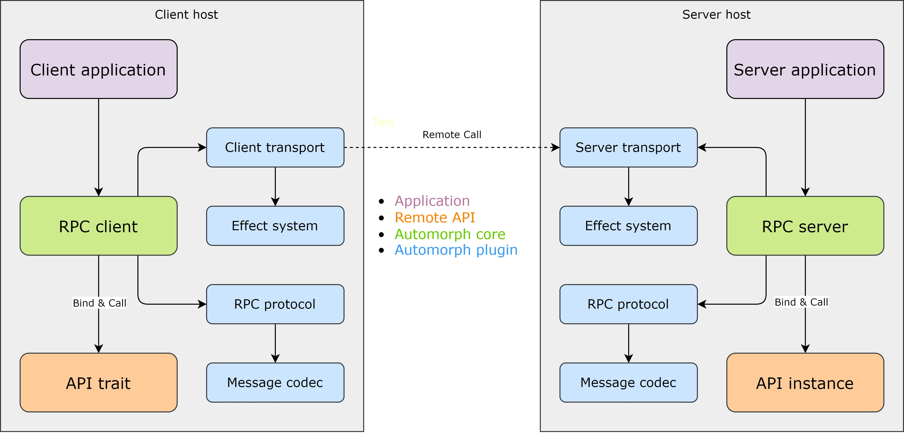

# Architecture

## Components composition

**Automorph** provides the following building blocks to assemble either standalone RPC clients and servers or integrate
with existing systems by freely combining its various plugins:

- [RPC client](https://automorph.org/api/automorph/RpcClient.html)
- [RPC server](https://automorph.org/api/automorph/RpcServer.html)
- [RPC protocol](https://automorph.org/api/automorph/spi/RpcProtocol.html)
- [Effect system](https://automorph.org/api/automorph/spi/EffectSystem.html)
- [Message codec](https://automorph.org/api/automorph/spi/MessageCodec.html)
- [Client transport](https://automorph.org/api/automorph/spi/ClientTransport.html)
- [Server transport](https://automorph.org/api/automorph/spi/ServerTransport.html)

## Entry points

### [RPC client](https://automorph.org/api/automorph/RpcClient.html)

Used to perform type-safe remote API calls or send one-way messages.

Remote APIs can be invoked statically using transparent proxy instances automatically derived from specified API
 traits or dynamically by supplying the required type information on invocation.

**Depends on**

- [Client transport](https://automorph.org/api/automorph/spi/ClientTransport.html)
- [RPC protocol](https://automorph.org/api/automorph/spi/RpcProtocol.html)

**Used by**

- Applications

### [RPC server](https://automorph.org/api/automorph/RpcServer.html)

Used to handle remote API requests using specific transport protocol and invoke bound API
methods to process them.

Automatically derives remote API bindings for existing API instances.

**Depends on**

- [Server transport](https://automorph.org/api/automorph/spi/ServerTransport.html)
- [RPC protocol](https://automorph.org/api/automorph/spi/RpcProtocol.html)

**Used by**

- Applications

## Plugins

### [RPC protocol](https://automorph.org/api/automorph/spi/RpcProtocol.html)

Remote procedure call protocol plugin.

The underlying RPC protocol must support remote function invocation.

**Depends on**

- [Message codec](https://automorph.org/api/automorph/spi/MessageCodec.html)

**Used by**

- [RPC client](https://automorph.org/api/automorph/RpcClient.html)
- [RPC server](https://automorph.org/api/automorph/RpcServer.html)

### [Effect system](https://automorph.org/api/automorph/spi/EffectSystem.html)

Computational effect system plugin.

The underlying runtime must support monadic composition of effectful values.

**Used by**

- [Client transport](https://automorph.org/api/automorph/spi/ClientTransport.html)
- [Server transport](https://automorph.org/api/automorph/spi/ServerTransport.html)

### [Message codec](https://automorph.org/api/automorph/spi/MessageCodec.html)

Structured message format codec plugin.

The underlying data format must support storing arbitrarily nested structures of basic data types.

**Used by**

- [RPC protocol](https://automorph.org/api/automorph/spi/RpcProtocol.html)

### [Client transport](https://automorph.org/api/automorph/spi/ClientTransport.html)

Client transport layer plugin.

Enables RPC client to send requests and receive responses to and from a remote server using specific transport protocol.

**Depends on**

- [Effect system](https://automorph.org/api/automorph/spi/EffectSystem.html)

**Used by**

- [RPC client](https://automorph.org/api/automorph/RpcClient.html)

### [Server transport](https://automorph.org/api/automorph/spi/ServerTransport.html)

Server transport layer plugin.

Enables RPC server to receive requests from remote client and send responses using specific transport protocol.

**Depends on**

- [Effect system](https://automorph.org/api/automorph/spi/EffectSystem.html)

**Used by**

- [RPC server](https://automorph.org/api/automorph/RpcServer.html)

