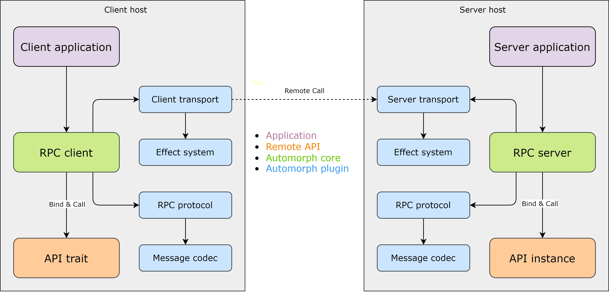
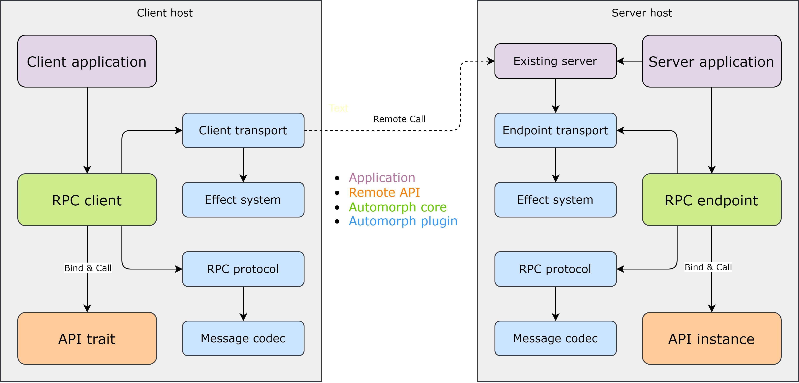

# Architecture

## Components

**Automorph** provides the following building blocks to assemble either standalone RPC clients and servers or integrate
with existing systems by freely combining its various plugins:

* [RPC client](/api/automorph/RpcClient.html)
* [RPC server](/api/automorph/RpcServer.html)
* [RPC endpoint](/api/automorph/RpcEndpoint.html)
* [RPC protocol](/api/automorph/spi/RpcProtocol.html)
* [Effect system](/api/automorph/spi/EffectSystem.html)
* [Message codec](/api/automorph/spi/MessageCodec.html)
* [Client transport](/api/automorph/spi/ClientTransport.html)
* [Server transport](/api/automorph/spi/ServerTransport.html)
* [Endpoint transport](/api/automorph/spi/EndpointTransport.html)

### RPC client & server composition

### RPC client & endpoint composition

## [RPC client](/api/automorph/RpcClient.html)

Used to perform type-safe remote API calls or send one-way messages.

Remote APIs can be invoked statically using transparent proxy instances automatically derived from specified API
 traits or dynamically by supplying the required type information on invocation.

**Depends on**

* [Client transport](/api/automorph/spi/ClientTransport.html)
* [RPC protocol](/api/automorph/spi/RpcProtocol.html)

**Used by**

* Applications

## [RPC server](/api/automorph/RpcServer.html)

Used to serve remote API requests using specific transport protocol and invoke bound API
methods to process them.

Automatically derives remote API bindings for existing API instances.

**Depends on**

* [Server transport](/api/automorph/spi/ServerTransport.html)
* [RPC protocol](/api/automorph/spi/RpcProtocol.html)

**Used by**

* Applications

## [RPC endpoint](/api/automorph/RpcEndpoint.html)

Integrates with an existing server to receive remote API requests using
specific transport protocol and invoke bound API methods to process them.

Automatically derives remote API bindings for existing API instances.

**Depends on**

* [Endpoint transport](/api/automorph/spi/EndpointTransport.html)
* [RPC protocol](/api/automorph/spi/RpcProtocol.html)

**Used by**

* Applications

## [RPC protocol](/api/automorph/spi/RpcProtocol.html)

Remote procedure call protocol plugin.

The underlying RPC protocol must support remote function invocation.

**Depends on**

* [Message codec](/api/automorph/spi/MessageCodec.html)

**Used by**

* [Client](/api/automorph/RpcClient.html)
* [Server](/api/automorph/RpcServer.html)
* [Endpoint](/api/automorph/RpcEndpoint.html)

## [Effect system](/api/automorph/spi/EffectSystem.html)

Computational effect system plugin.

The underlying runtime must support monadic composition of effectful values.

**Used by**

* [Client transport](/api/automorph/spi/ClientTransport.html)
* [Server transport](/api/automorph/spi/ServerTransport.html)
* [Endpoint transport](/api/automorph/spi/EndpointTransport.html)

## [Message codec](/api/automorph/spi/MessageCodec.html)

Structured message format codec plugin.

The underlying data format must support storing arbitrarily nested structures of basic data types.

**Used by**

* [RPC protocol](/api/automorph/spi/RpcProtocol.html)

The underlying transport protocol must support request/response messaging pattern.

## [Client transport](/api/automorph/spi/ClientTransport.html)

Client transport protocol plugin.

Passively sends requests and receives responses to and from a remote endpoint using specific transport protocol.

**Depends on**

* [Effect system](/api/automorph/spi/EffectSystem.html)

**Used by**

* [Client](/api/automorph/RpcClientTransport.html)

## [Server transport](/api/automorph/spi/ServerTransport.html)

Server transport protocol plugin.

Actively receives requests to be processed by the RPC handler and sends responses using specific transport protocol.

**Depends on**

* [Effect system](/api/automorph/spi/EffectSystem.html)

**Used by**

* Applications

## [Endpoint transport](/api/automorph/spi/EndpointTransport.html)

Existing transport protocol server integration plugin.

Passively parses requests to be processed by the RPC handler and creates responses for specific server.

**Depends on**

* [Effect system](/api/automorph/spi/EffectSystem.html)

**Used by**

* Applications
